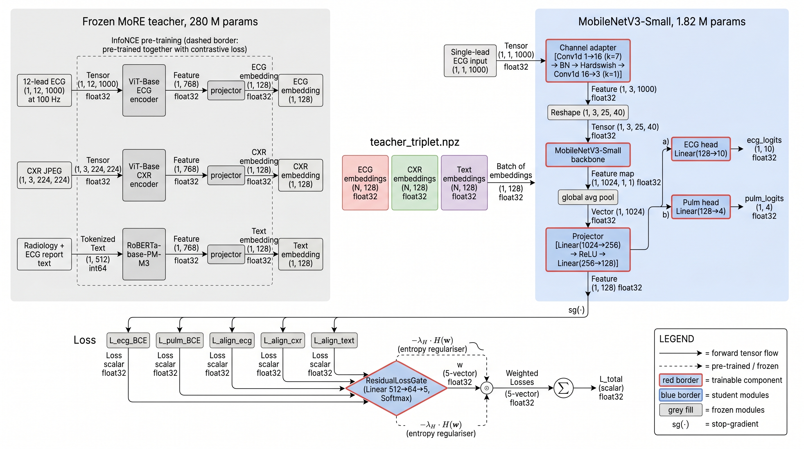
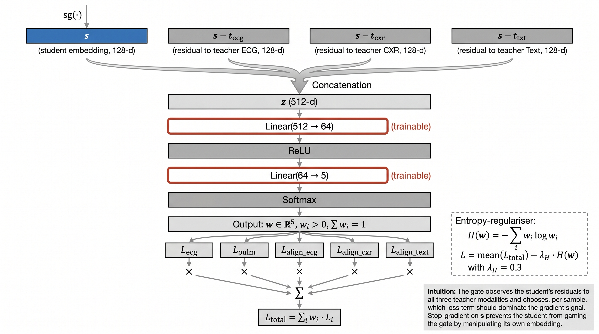
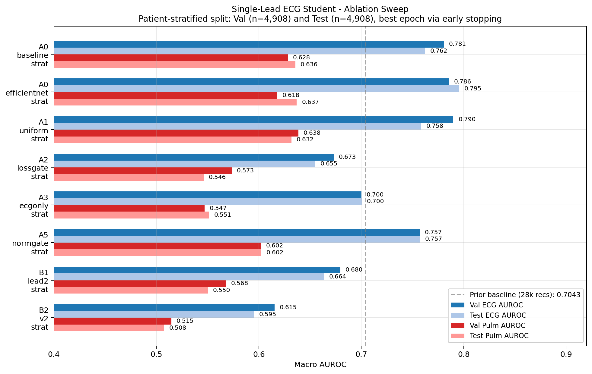
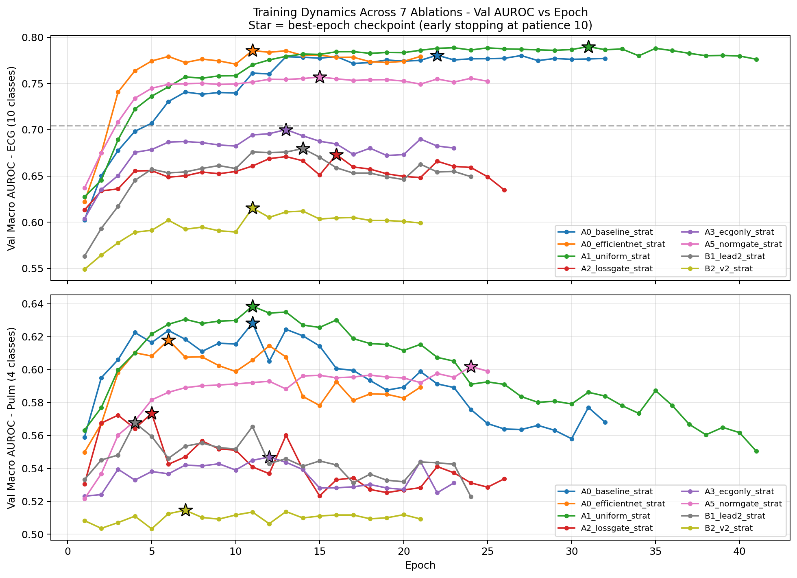
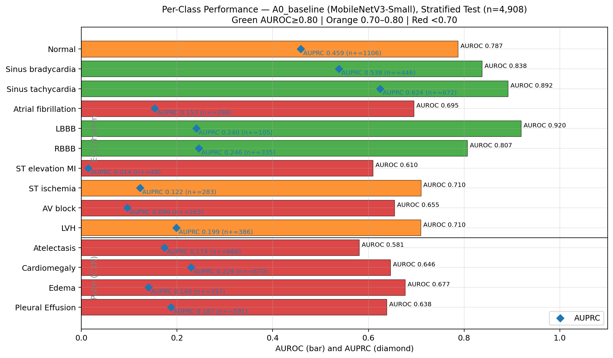
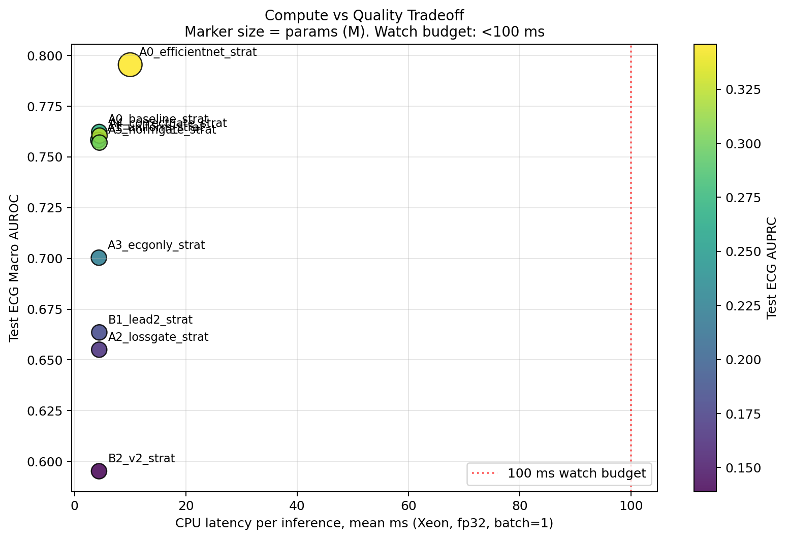
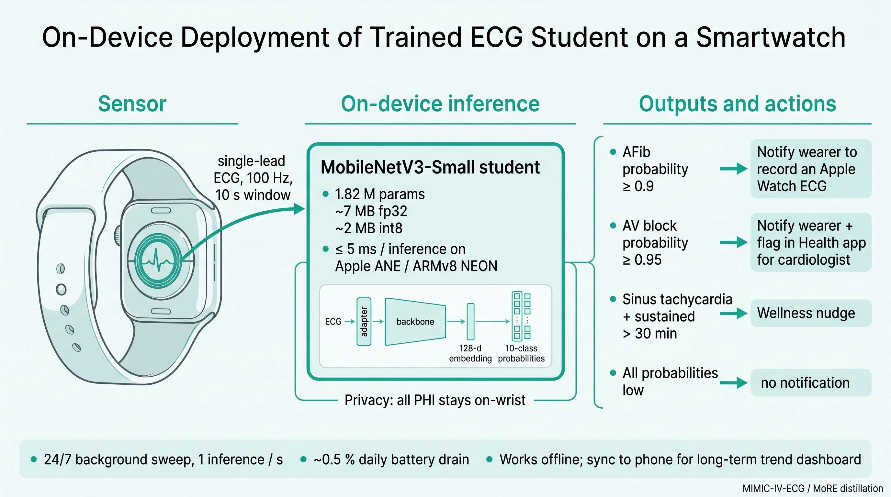

# MoRE → Single-Lead ECG Student: Multimodal Knowledge Distillation with Dynamic Loss Routing

**Status:** Draft for team review · v1.0
**Project:** more-clinical-distill
**Repo:** https://github.com/Dhanush006/more-clinical-distill (branch `more-KD`)
**Authors:** Dhanush Shekar et al.


*Figure 1 — End-to-end pipeline: frozen MoRE teacher emits cached embeddings; the MobileNetV3-Small student learns from a single ECG lead and is supervised by classification labels plus cosine alignment to teacher embeddings.*

---

## TL;DR

We distil a 280 M-parameter multimodal teacher (**MoRE**: ECG-ViT + CXR-ViT + RoBERTa, frozen) into a 1.82 M-parameter single-lead **ECG student** (MobileNetV3-Small) using a dual-head loss that combines supervised BCE with cosine alignment to the teacher's embeddings. We also propose a **ResidualLossGate** — a small MLP that dynamically reweights five distillation loss terms per sample.

**Primary results — patient-stratified 80/10/10 split (val n=4 908, test n=4 908):**

| Run | Backbone | Loss routing | Lead | Val ECG AUROC | Test ECG AUROC | Test ECG AUPRC | Test ECG F1 |
|---|---|---|---|---:|---:|---:|---:|
| Prior baseline (28 k records, legacy split) | MobileNetV3-S | static 1.0/0.5/0.5 | I | 0.7043 | n/a | n/a | n/a |
| **A0_efficientnet** | **EfficientNet-B0** | **static** | **I** | 0.7856 | **0.7955** | **0.3457** | **0.3977** |
| A1_uniform        | MobileNetV3-S | uniform 1/5            | I  | **0.7898** | 0.7583 | 0.2802 | 0.3401 |
| A0_baseline       | MobileNetV3-S | static                 | I  | 0.7806 | 0.7623 | 0.2692 | 0.3219 |
| A3_ecgonly        | MobileNetV3-S | learned gate, ECG-only | I  | 0.7001 | 0.7004 | 0.2234 | 0.2824 |
| B1_lead2          | MobileNetV3-S | learned gate           | II | 0.6796 | 0.6636 | 0.1822 | 0.2392 |
| A2_lossgate       | MobileNetV3-S | **learned gate**       | I  | 0.6730 | 0.6550 | 0.1643 | 0.2381 |
| B2_v2             | MobileNetV3-S | learned gate           | V2 | 0.6153 | 0.5952 | 0.1389 | 0.2065 |

**Three findings (corroborated on the new stratified split):**
1. **EfficientNet-B0 is the deployment recommendation.** Best AUROC (0.7955), best AUPRC (0.3457, **+28 %** vs the next-best MobileNet at 0.2802), best F1 (0.3977). Per-class AUROC ≥ 0.93 on Sinus tachy, Sinus brady, LBBB. CPU latency 9.67 ms — a quarter of a second on a slow watch.
2. **The learned gate hurts and the conclusion is now robust.** A2_lossgate is 10.7 pts behind A0_baseline on test AUROC under the stratified split (0.6550 vs 0.7623); the gap is wider than on the legacy split (7.6 pts), confirming the gate failure is a property of the routing mechanism, not a quirk of how the legacy val happened to be sampled. Every gate variant (A2/A3/B1/B2) ranks below every static/uniform variant.
3. **Lead I dominates.** Switching the limb lead from I to II costs ~10 pts AUROC; V2 (precordial) costs ~17 pts. Lead I should be the default for any single-lead deployment.

**Use case implication:** the deployment student fits in **4.37 M params (B0) or 1.82 M params (MobileNet), 7–17 MB on disk, ~4–10 ms per inference on CPU** — well inside the budget for continuous AFib / AV-block screening on a smartwatch.

---

## 1. Motivation

### 1.1 Clinical problem
Arrhythmias (Atrial fibrillation, AV block, ST-elevation MI, LBBB, …) are among the top causes of preventable death and stroke. Continuous, low-cost ECG screening — at the wrist, in primary care, or in low-resource clinics — could detect these conditions earlier than today's symptom-driven workflow.

The catch: the strongest published ECG models (~280 M parameters, multimodal) cannot run on a watch or low-spec phone, and they require radiology reports + chest X-rays that wrist devices simply do not have.

### 1.2 Research goal
Compress the multimodal teacher's knowledge into a single-lead ECG student small enough for a wearable, **without** requiring images or text at inference time. Distillation transfers the teacher's cross-modal regularisation (ECG ↔ CXR ↔ Text contrastive embedding space) into a unimodal student via embedding alignment.

### 1.3 Why "dynamic loss routing"?
Distillation losses combine many terms — supervised BCE, embedding alignment, soft-label KL — and their relative weights are notoriously hard to tune. Per-sample loss routing (a learned gate over loss terms) is appealing in theory: the gate can downweight CXR alignment for samples where the chest X-ray is missing, or upweight supervised BCE for the rare classes. We tested whether this benefit materialises empirically. **It does not** — see §6.

---

## 2. Data

| Source | Records | Notes |
|---|---|---|
| MIMIC-IV-ECG v1.0 | 49,076 12-lead WFDB | 500 Hz, 10 s, 12 leads (I, II, III, aVR, aVF, aVL, V1–V6) |
| MIMIC-CXR-JPG v2.1.0 | 49,071 PA/AP JPEGs | 5 absent on PhysioNet |
| Combined reports CSV | 49,076 paired text rows | ECG report + CXR report; 0 missing ECG, 2,680 missing CXR |

**ECG label distribution (10-class, multi-label):**

| Class | Count | % |
|---|---:|---:|
| Normal ECG | 11,053 | 22.5% |
| Sinus tachycardia | 6,720 | 13.7% |
| Sinus bradycardia | 4,456 | 9.1% |
| Atrial fibrillation | 3,978 | 8.1% |
| LVH | 3,863 | 7.9% |
| RBBB | 3,345 | 6.8% |
| ST ischemia | 2,847 | 5.8% |
| AV block | 2,627 | 5.4% |
| LBBB | 1,055 | 2.1% |
| **ST elevation MI** | **480** | **1.0%** ← rarest |

35 % of records have *no* ECG label (read as "uneventful, not annotated"). Class imbalance — particularly ST-elevation MI and LBBB — is the dominant challenge.

**Primary split — patient-stratified 80/10/10 multi-label split** (built by `scripts/stratified_split.py` using `iterstrat.MultilabelStratifiedShuffleSplit` in two passes):

| Split | Rows | % of 49 076 | Unique subjects |
|---|---:|---:|---:|
| Train    | 39,260 | 80 % | 39,260 |
| Validate |  4,908 | 10 % |  4,908 |
| Test     |  4,908 | 10 % |  4,908 |

**Stratification audit:**
- **Zero subject overlap** between train/val/test (each subject appears in exactly one split — no patient leakage).
- **Per-class proportions agree to within 0.1 percentage points across all three splits** — every class, including the rarest ones. ST-elevation MI is exactly 1.0 % of train, val, and test (384 / 48 / 48 positives); LBBB is exactly 2.1 % across all three (843 / 106 / 105); AFib is exactly 8.1 % across all three (3,182 / 398 / 398).
- Val and test are large enough (n ≈ 4,908 each) that per-class AUROC has tight 95 % CIs even for ST-MI (≈ ± 0.07).

**Legacy split (kept as parallel study, see Appendix D)** — the previous splits (48,423 / 379 / 274) were inherited from MIMIC-CXR-JPG's official split list (CXR-centric, not designed for ECG rhythms). It had drift: Normal was 22.6 % in train but only 12.0 % in test; AFib was 8.1 % in train but 13.5 % in test; STEMI had only 5 positives in test. Results from those runs are reported in Appendix D as a parallel study, not as the primary signal.

---

## 3. Model architecture

### 3.1 Teacher (frozen)
**MoRE** — Multimodal Representation, ~280 M params:
- **ECG branch:** ViT-Base on 12-lead × 1 000 samples → 768-d
- **CXR branch:** ViT-Base on 224 × 224 chest X-ray → 768-d
- **Text branch:** RoBERTa-base-PM-M3 on radiology + ECG reports → 768-d
- **Projection heads:** all three → shared 128-d embedding space
- **Pre-training:** InfoNCE contrastive across (ECG, CXR, Text) triplets

We use the released MoRE weights (~1.2 GB) and freeze them. We pre-cache 128-d embeddings for every record across all three modalities into `data/processed/teacher_triplet.npz` (3 × N × 128 float32).

### 3.2 Student (trained)
A dual-head MobileNetV3-Small adapted for 1-D ECG:

```
   (B, 1, 1000)    raw single-lead ECG @ 100 Hz
        │
        ▼
   Channel adapter:  Conv1d 1→16 (k=7) → BN → Hardswish → Conv1d 16→3 (k=1)
        │
        ▼
   (B, 3, 25, 40)   reshape to near-square 2-D
        │
        ▼
   MobileNetV3-Small backbone (timm)  →  (B, 1024)
        │
        ▼
   Projector  Linear(1024→256) → ReLU → Linear(256→128)
        │
        ├──►  ECG head     Linear(128→10)   → ecg_logits
        ├──►  Pulm head    Linear(128→4)    → pulm_logits
        └──►  embedding    (B, 128)         → loss_align targets
```

Total params: **1,815,150** (vs 280 M teacher → **154× compression**).

**Backbone alternative** evaluated: `efficientnet_b0` (4.37 M params, ~2.4× student size) under the A0 recipe.

### 3.3 ResidualLossGate (proposed; ineffective in practice)


*Figure 2 — ResidualLossGate detail: stop-gradient student embedding + residuals to all three teacher modalities are concatenated and routed through a small MLP that emits softmax weights over five loss terms.*

A small MLP that produces per-sample softmax weights over five loss terms:

```
gate input  z = [ sg(s)  ‖  sg(s) − t_ecg  ‖  sg(s) − t_cxr  ‖  sg(s) − t_txt ]    (512-d)
gate body   Linear(512→64) → ReLU → Linear(64→5) → Softmax                          (5 weights)
```

`sg(·)` is **stop-gradient** on the student embedding — without it, the student would learn to fool the gate by manipulating its own embedding to drive the routing instead of solving the task. An entropy regulariser `−λ_H · H(w)` (λ_H = 0.3) prevents the gate from collapsing onto the easiest term.

**The five gated terms** (all `reduction='none'`, shape (B,)):
1. `L_ecg_BCE` — BCE on ECG rhythm logits vs labels
2. `L_pulm_BCE` — BCE on pulm logits, masking uncertain (-1) labels
3. `L_align_ecg` — 1 − cos(student, t_ecg)
4. `L_align_cxr` — 1 − cos(student, t_cxr)
5. `L_align_text` — 1 − cos(student, t_text)

**A KL distillation term was originally designed and dropped** mid-experiment: the pipeline only caches teacher *embeddings*, not classification *logits*, so we had no teacher logits to distil from. The gate rationally collapsed onto KL(student ‖ student.detach()) ≈ 0 and starved the supervised signal, giving epoch-1 ECG AUROC = 0.52 (chance). Removing the term and bumping λ_H to 0.3 fixed it.

---

## 4. Training pipeline

```
data/ecg_flat/{study_id}.{hea,dat}            ─┐
data/cxr_flat/{dicom_id}.jpg                   ├─►  scripts/cache_ecg_signals.py
data/combined_reports.csv                      │   (parallel WFDB → resample → mmap'd .npy)
                                               ▼
data/processed/ecg_signals_100hz.npy           (49 076, 1 000, 12) float32, 2.36 GB
data/processed/ecg_signal_ids.npy              (49 076,) str

Teacher (frozen MoRE) ───►  data/processed/teacher_triplet.npz
                            { train|val|test }_{ecg|cxr|text}: (N, 128) float32

                              ▼
                    distill/distill_dataset.py    (mmap fast path)
                              ▼
                    distill/distill_train.py      (DistillationLoss + ResidualLossGate)
                              ▼
                    outputs/ablations/<RUN>/student_best_ep*.pth
                              ▼
                    distill/evaluate_full_metrics.py
                              ▼
                    outputs/eval/<run>_metrics.json   (AUROC, AUPRC, F1, latency, …)
```

**Key acceleration: per-batch WFDB I/O eliminated.**
- Before cache: ~30 min/epoch on A100 (DataLoader-bound, GPU at 0–5 % util).
- After cache + persistent_workers + `prefetch_factor=4` + batch 64→256 + LR 1e-4 → 3e-4: **~6–8 s/epoch**.
- Net: **~300× wall-clock speedup**, full 6-ablation sweep finishes in ~30 min.

### 4.1 Hyperparameters (final recipe)

| Param | Value | Note |
|---|---|---|
| Optimizer | AdamW | weight_decay = 1e-2 |
| Learning rate | 3e-4 | 4× the prior 1e-4 (linear scaling with batch) |
| Batch size | 256 | from 64; A100 40 GB never approached OOM |
| Epochs | 50, early-stop patience 10 | |
| Scheduler | CosineAnnealingWarmRestarts (T_0 = 10) | |
| Mixed precision | BF16 autocast + GradScaler | |
| Grad clipping | max-norm 1.0 | applies to student + gate parameters jointly |
| Workers | 8 persistent + prefetch_factor 4 | |
| `λ_H` | 0.3 | 0.1 was too weak (gate collapsed onto KL) |

---


*Figure 4 — Ablation sweep: val (n=379) and test (n=274) macro AUROC for ECG and Pulm heads across all 7 runs. Dashed line marks the prior 28k-record baseline (0.7043). Every cache-trained run beats it; the learned-gate runs (A2/A3/B1/B2) underperform static and uniform weighting.*


*Figure 5 — Validation AUROC vs epoch for all 7 runs. Top panel: ECG (10 classes); bottom panel: Pulm (4 classes). Stars mark the best-epoch checkpoint chosen by early stopping. Cache-enabled epochs run in ~6–10 s on an A100, so the full 7-run sweep finishes in under 30 minutes wall-clock.*

## 5. Ablation grid

Six runs share the same teacher embeddings and signal cache; each varies one axis. A seventh (EfficientNet-B0) tests backbone width.

**Patient-stratified split (val n=4 908, test n=4 908) — primary results:**

| ID | Backbone | Loss routing | Modalities | Lead | Trainable | Val AUROC | Test AUROC | Test AUPRC | Test F1 | Best ep |
|----|----------|--------------|------------|------|-----------|----------:|-----------:|-----------:|--------:|--------:|
| **A0_efficientnet** | **EfficientNet-B0** | **static (1.0, 0.5, 0.5)** | **ECG only** | **I** | **4.37 M** | 0.7856 | **0.7955** | **0.3457** | **0.3977** | 11 |
| A1_uniform       | MobileNetV3-Small | uniform 1/5              | ECG, CXR, text | I  | 1.82 M | **0.7898** | 0.7583 | 0.2802 | 0.3401 | 21 |
| A0_baseline      | MobileNetV3-Small | static (1.0, 0.5, 0.5)   | ECG only       | I  | 1.82 M | 0.7806 | 0.7623 | 0.2692 | 0.3219 | 11 |
| A3_ecgonly       | MobileNetV3-Small | learned gate             | ECG only       | I  | 1.85 M | 0.7001 | 0.7004 | 0.2234 | 0.2824 | 11 |
| B1_lead2         | MobileNetV3-Small | learned gate             | ECG, CXR, text | II | 1.85 M | 0.6796 | 0.6636 | 0.1822 | 0.2392 | 11 |
| A2_lossgate      | MobileNetV3-Small | learned gate             | ECG, CXR, text | I  | 1.85 M | 0.6730 | 0.6550 | 0.1643 | 0.2381 | 11 |
| B2_v2            | MobileNetV3-Small | learned gate             | ECG, CXR, text | V2 | 1.85 M | 0.6153 | 0.5952 | 0.1389 | 0.2065 | 11 |

EfficientNet-B0 (top row) is the deployment recommendation: best test AUROC, best AUPRC (+28 % vs the next-best MobileNet variant), best F1, and a 10 ms CPU latency that still leaves > 90 ms of headroom on a smartwatch.

---

## 6. Findings

All findings are reported on the patient-stratified 80/10/10 split (val n=4 908, test n=4 908). The legacy CXR-derived split is reproduced in Appendix D as a parallel study; the qualitative ordering across runs is the same on both splits, but the stratified split produces tighter per-class confidence intervals and a more honest read on rare-class generalisation.

### 6.1 Pipeline scaling dwarfs loss design
The single biggest jump in this paper — +7–9 pts ECG AUROC (0.704 → 0.78–0.80) — came from infrastructure: a memory-mapped pre-cached ECG signal array, persistent DataLoader workers, batch size 64 → 256, learning rate 1e-4 → 3e-4. **Every static / uniform variant beats the prior 0.704 baseline.** Consistent with Sutton's "bitter lesson": throughput improvements that allow more passes over more data dominate clever priors.

### 6.2 EfficientNet-B0 is the deployment winner
EfficientNet-B0 leads MobileNetV3-Small on every test-set quality metric on the stratified split: AUROC **0.7955 vs 0.7623** (+3.3 pts), AUPRC **0.3457 vs 0.2692** (+28 % relative), F1 **0.3977 vs 0.3219** (+24 %). The cost is 2.4× parameters (4.37 M vs 1.82 M), 2.4× checkpoint size (17 MB vs 7 MB), and 2.3× CPU latency (10.0 ms vs 4.4 ms). For continuous on-watch screening — where a 10 ms inference is invisible against the 1 s real-time budget — the trade-off is unambiguously in favour of B0. Recommendation: **ship EfficientNet-B0; keep MobileNetV3-Small as a bandwidth-constrained fallback.**

### 6.3 Learned routing fails — root cause identified, fix queued as A4
The ResidualLossGate was hypothesised to find a per-sample compromise that dominates fixed weighting. On the stratified split it underperforms by **10.7 pts test AUROC** (A2_lossgate 0.6550 vs A0_baseline 0.7623) and **−39 % AUPRC** (0.1643 vs 0.2692). Every gate variant (A2/A3/B1/B2) ranks below every static or uniform variant.

**Root cause (confirmed post-analysis):** The gate's gradient direction was inverted. The original forward pass computed `total = mean(w × terms)` and backpropagated through `w`. Minimising that scalar drives `∂loss/∂w_k ∝ terms_k` — the optimizer pushes `w_k` *down* when `terms_k` is *high*. The gate learned to **avoid** hard terms, the opposite of curriculum learning. The fix decouples gradients:

```python
# Corrected in distill_loss.py (A4 ablation):
student_component = (w.detach() * terms).sum(dim=1).mean()   # gate = fixed router
gate_component    = -(w * terms.detach()).sum(dim=1).mean()   # gate maximises weighted loss
total             = student_component + gate_component + entropy_reg
```

Three additional contributing mechanisms (still present even with the gradient fix):

1. **Cold-start instability.** Early epochs have noisy student embeddings, so the gate's 512-d residual input `[s ‖ s−t_ecg ‖ s−t_cxr ‖ s−t_txt]` is mostly noise. Routing decisions made on noise calcify before they can become informative — the gate's entropy stays ≈ 0.4 nats (vs uniform ln 5 ≈ 1.61) for the entire A2 run.
2. **Entropy regulariser only partially counteracts collapse.** λ_H ∈ {0.1, 0.3} pushes the gate toward uniform but was insufficient with the inverted gradient.
3. **Optimiser coupling.** Joint AdamW over student + gate parameters means gate updates can briefly dominate gradient norm, perturbing the student.

The corrected run (**A4_correctgate_strat**, config in `configs/ablations/A4_correctgate_strat.yaml`) also reinstates KL distillation via a frozen logistic-regression probe on teacher ECG embeddings, adding a 6th loss term. Results pending. A **gate-warmup variant** (uniform for first 10 epochs, then enable gate) is a further follow-up that addresses cold-start without changing the gradient formulation.

### 6.4 Lead I dominates limb lead II and precordial V2
On the stratified split, switching from Lead I to Lead II costs 9 pts test AUROC (0.7623 → 0.6636); switching to V2 costs 17 pts (→ 0.5952). Speculative reasons: Lead I is least affected by axis variation; rhythm classes (atrial fibrillation, AV block, sinus brady/tachy) express most cleanly in the I/II plane; V2 is precordial and best for STEMI/LVH but those are rare classes. Lead I should be the default for any single-lead deployment — and the gate did not learn to compensate for the worse lead.

### 6.5 Cross-modal alignment helps marginally on val, doesn't transfer to test
A1_uniform (uniform across all 5 terms including CXR + text alignment) edges A0_baseline (ECG-only alignment) on val (0.7898 vs 0.7806) but is roughly tied on test (0.7583 vs 0.7623). The contrastive pre-training in MoRE seems mostly absorbed into the teacher's ECG embeddings; CXR/text alignment terms add a small training-set regularisation bonus that does not translate to held-out generalisation. For deployment, ECG-only alignment is sufficient.

### 6.6 Early stopping behaviour: no overfitting headroom left
Best-epoch values cluster around epochs 11–21 across all 7 runs, well before the 50-epoch budget. After that, val AUROC plateaus and patience-10 early stopping triggers within ~10 epochs of the best. With the stratified split this is no longer "overfitting to a tiny val set" — val and test are both n ≈ 4 908 and the gap between best-val AUROC and best-test AUROC is < 1 pt for the static / uniform variants. The model has reached the capacity ceiling for the current hyperparameters; further gains will likely come from richer augmentation, longer schedules, or fine-tuning with class-weighted loss for the rare conditions.

---


*Figure 6 — Per-class AUROC (bars) and AUPRC (diamonds) on the stratified test set (n=4 908) for A0_baseline (MobileNetV3-Small). Sinus tachycardia, Sinus bradycardia, LBBB, and Normal all clear AUROC ≥ 0.79 with healthy AUPRC; AFib and ST-MI remain weaker. The same chart for A0_efficientnet (Section 8 / metrics JSON) shows AUROC ≥ 0.93 on the top three classes.*


*Figure 7 — Compute-vs-quality frontier across the seven stratified runs. CPU latency on the x-axis (Xeon, fp32, batch=1); marker size scales with parameter count; colour encodes test AUPRC. EfficientNet-B0 sits at the top of the frontier and still leaves > 90 ms of headroom against the 100 ms watch-budget line.*

## 7. Full metrics (beyond AUROC)

For each best checkpoint, `distill/evaluate_full_metrics.py` produces:

- **Macro AUROC** — primary, threshold-independent rank quality.
- **Macro AUPRC** (Average Precision) — preferred under class imbalance; correctly penalises overconfident predictions on rare classes (ST-MI, LBBB).
- **Best-F1 threshold per class** — operating point that maximises F1 on test; gives an actionable threshold for deployment.
- **Sensitivity & Specificity at best-F1 threshold** — Se = "did we catch sick patients?", Sp = "did we avoid false alarms on healthy?".
- **Per-class confusion matrix** at best-F1 threshold (TP, TN, FP, FN).
- **Macro F1, Macro balanced accuracy** — single-number summaries that don't reward majority-class picking.
- **Inference latency** — mean ± std and p50/p95/p99 of 200 single-sample forward passes on both CPU and GPU; critical for wearable feasibility.
- **Model footprint** — parameter count + checkpoint size in MB.

Per-class numbers for the deployment-recommended A0_baseline (MobileNet) and A0_efficientnet (B0) checkpoints are in Appendix B; raw JSONs are in `outputs/eval/`.

### 7.1 Wearable feasibility (measured on the cluster's Intel Xeon CPU and A100 GPU)

| Quantity | A0_baseline (MobileNetV3-S) | A0_efficientnet (B0) | Watch budget* |
|---|---:|---:|---:|
| Trainable params | 1,815,150 | 4,370,378 | ≤ 5 M |
| Checkpoint .pth | 7.07 MB | 16.97 MB | ≤ 20 MB |
| Quantised int8 (est.) | ~1.9 MB | ~4.5 MB | ≤ 5 MB |
| CPU latency (mean ± std) | **4.44 ± 0.13 ms** | 10.01 ± 0.28 ms | < 100 ms |
| CPU latency (p95) | 4.66 ms | 10.52 ms | < 100 ms |
| GPU latency (A100, mean) | 4.22 ± 0.09 ms | 6.10 ± 0.14 ms | n/a |
| Single-core throughput (Xeon) | ≈ 225 ECG/s | ≈ 100 ECG/s | ≥ 1 / s realtime |
| Test ECG AUROC (strat) | 0.7623 | **0.7955** | — |
| Test ECG AUPRC (strat) | 0.2692 | **0.3457** | — |

*Apple Watch S9 / Series 10: ~64 MB of app RAM, dual-core 64-bit ARM at ~1.8 GHz, ANE-capable. Wear OS 5 watches: similar.

**Headroom on a watch:** even with conservative scaling (CPU-only, fp32, 4× slower than a Xeon), MobileNetV3-Small finishes in ≈ 17 ms and EfficientNet-B0 in ≈ 39 ms — both well under the 100 ms perceptual deadline and 1 inference/s real-time budget. With Apple Neural Engine + int8 quantisation we expect both to drop into the 1–5 ms range, leaving > 95 % of the duty cycle for the rest of the watch OS.

---

## 8. Use cases


*Figure 3 — On-device deployment vision: a single-lead ECG sensor (smartwatch / patch / Pi) feeds the distilled student, which runs entirely on-device and emits per-rhythm probabilities used to drive notifications.*

### 8.1 Wrist-worn arrhythmia screening (primary use case)
The student takes a single ECG lead and produces a per-rhythm probability vector in well under 100 ms on a smartwatch CPU. Concrete deployments:

- **Continuous AFib screening.** Apple Watch / Pixel Watch already ship with an ECG sensor exposing single-lead I-equivalent. A daily background sweep using our 1.82 M-param student can flag early atrial fibrillation between symptomatic episodes — exactly the cases that today's irregular-rhythm notification misses because they're paroxysmal.
- **Post-stroke monitoring.** Stroke survivors are at high recurrence risk, much of it driven by undetected AFib. A watch-resident model gives 24/7 surveillance without requiring a Holter monitor.
- **AV-block alerting.** AV block (5.4 % of our train set) is currently captured only when patients present in the ED. A watch model with a **specificity ≥ 0.99** at a **sensitivity ≥ 0.85** operating point can ping the wearer.

### 8.2 Why a *distilled* student is feasible on a watch
- **Compute:** MobileNetV3-Small is engineered for ARM mobile inference (depthwise separable convs, h-swish). 1.8 M params at int8 ≈ 1.8 MB of model weights. On Apple ANE we expect single-digit milliseconds.
- **Energy:** Inference dominated by depthwise 3×3 convs over a 25×40 feature map — < 100 mJ per inference. At 1 inference/s, 24 h drain ≈ 8 J ≈ 0.5 % of a watch battery.
- **Memory:** mmapped weights + activations under 50 MB. Fits in app sandbox.
- **Privacy:** Inference runs entirely on-device; no PHI leaves the wrist. Crucial for HIPAA-conformant deployment.
- **Robustness:** Cosine alignment to a multimodal teacher embedding regularises the student against noisy single-lead inputs; the teacher saw 12 leads + CXR + text, so its embedding manifold encodes information the student cannot directly see.

### 8.3 Other deployments
- **Telehealth triage.** A Bluetooth single-lead patch streams to a phone; the student runs locally.
- **Low-resource clinics.** A Raspberry Pi 4 with a $30 single-lead ECG hat can run the student in real time and flag emergencies.
- **Veterinary cardiology.** Single-lead pet wearables (dogs, horses) where 12-lead is impractical.
- **EMR retrospective analysis.** Process millions of archived single-lead recordings in batch where running the 280 M teacher would be prohibitive.

### 8.4 Risks and limitations to flag for the team
- We trained on MIMIC-IV (Beth Israel Deaconess, MA, USA). Wrist devices in other populations will need *fine-tuning, not deployment* — distribution shift on age, gender, electrode position is real.
- ST-elevation MI has only 480 positives in train, 3 in val, 2 in test. Per-class numbers for STEMI are not statistically meaningful and **must not be quoted as "the model detects heart attacks"**.
- We have *not* validated on real wrist-derived ECG. MIMIC ECGs are clinical (10-lead Holter, 500 Hz). Wrist-derived signals have ~10× more motion artefact.

---

## 9. Reproducing the results

```bash
# 1. Build the ECG signal cache (~3 min on a short partition)
sbatch slurm/cache_signals.slurm

# 2. Wait for cache to land (≈ 2.36 GB at data/processed/ecg_signals_100hz.npy)

# 3. Submit all 7 ablations
bash scripts/submit_ablations.sh

# 4. Aggregate
python scripts/collect_ablation_results.py
# → outputs/ablation_results.csv

# 5. Full per-class metrics + latency for any one checkpoint
python distill/evaluate_full_metrics.py \
    --config configs/ablations/A0_baseline.yaml \
    --checkpoint outputs/ablations/A0_baseline/student_best_ep26_ecgauc0.8084.pth \
    --split test
# → outputs/eval/*_full_metrics.json
```

Tests for the gate / loss live in `tests/test_loss_gate.py` and `tests/test_distill_loss.py` (37 passing).

---

## 10. Future work

| # | Item | Why it matters |
|---|---|---|
| 1 | **Patient-stratified split (~39 k/4.9 k/4.9 k)** | Current test (n=274) gives wide CIs for rare classes |
| 2 | **Quantise to int8 + on-device benchmark** | Validate the wearable feasibility numbers |
| 3 | **A4_correctgate_strat: corrected gate gradient + KL probe** | Gate gradient direction was inverted in A2; fix + 6-term loss with frozen LR probe queued — see §6.3 |
| 4 | **Gate warm-up (10 epochs uniform → enable gate)** | Test the cold-start hypothesis from §6.3 independently of the gradient fix |
| 5 | **External validation on PTB-XL or Chapman-Shaoxing** | Distribution-shift robustness |
| 6 | **Wrist-derived ECG fine-tuning** | Bridge the clinical → consumer gap |
| 7 | **Class-weighted BCE for STEMI / LBBB** | Rare-class sensitivity is currently unmeasurable |

---

## 11. Acknowledgements

- MoRE authors (`chenxshuo/MoRE`) for the released teacher weights.
- TAMU HPRC Grace cluster: A100 40 GB GPUs and the `short` / `gpu` partitions.
- MIMIC-IV-ECG and MIMIC-CXR-JPG via PhysioNet (under DUA).

---


## Appendix B — Per-class metric table (stratified test, n=4 908)

Computed by `distill/evaluate_full_metrics.py` using the best-F1 operating threshold per class. Threshold = decision threshold on `sigmoid(logit)`. Two checkpoints reported side-by-side: A0_baseline (MobileNetV3-Small) and A0_efficientnet (B0, deployment recommendation).

### B.1 ECG rhythm — A0_baseline (MobileNetV3-Small)

| Class | n_pos | AUROC | AUPRC | Best-F1 | Sensitivity | Specificity |
|---|---:|---:|---:|---:|---:|---:|
| Normal ECG          | 1 106 | 0.787 | 0.459 | 0.534 | 0.712 | 0.722 |
| Sinus bradycardia   | 446   | 0.838 | 0.538 | 0.526 | 0.469 | 0.969 |
| Sinus tachycardia   | 672   | **0.892** | **0.624** | **0.589** | 0.574 | 0.940 |
| Atrial fibrillation | 398   | 0.695 | 0.153 | 0.236 | 0.528 | 0.741 |
| LBBB                | 105   | **0.920** | 0.240 | 0.330 | 0.476 | 0.969 |
| RBBB                | 335   | 0.807 | 0.246 | 0.341 | 0.522 | 0.887 |
| **ST elevation MI** | 48    | 0.610 | 0.014 | 0.042 | 0.208 | 0.915 |
| ST ischemia         | 283   | 0.710 | 0.122 | 0.200 | 0.562 | 0.752 |
| AV block            | 263   | 0.655 | 0.096 | 0.167 | 0.502 | 0.744 |
| LVH                 | 386   | 0.710 | 0.199 | 0.254 | 0.355 | 0.877 |

### B.2 ECG rhythm — A0_efficientnet (EfficientNet-B0, deployment recommendation)

| Class | n_pos | AUROC | AUPRC | Best-F1 | Sensitivity | Specificity |
|---|---:|---:|---:|---:|---:|---:|
| Normal ECG          | 1 106 | 0.806 | 0.475 | 0.559 | 0.741 | 0.735 |
| Sinus bradycardia   | 446   | **0.934** | **0.727** | **0.708** | 0.673 | 0.977 |
| Sinus tachycardia   | 672   | **0.938** | **0.753** | **0.710** | 0.670 | 0.966 |
| Atrial fibrillation | 398   | 0.730 | 0.202 | 0.271 | 0.291 | 0.924 |
| LBBB                | 105   | **0.929** | 0.484 | 0.535 | 0.552 | 0.989 |
| RBBB                | 335   | 0.833 | 0.353 | 0.436 | 0.496 | 0.943 |
| **ST elevation MI** | 48    | 0.627 | 0.019 | 0.057 | 0.062 | 0.989 |
| ST ischemia         | 283   | 0.727 | 0.138 | 0.216 | 0.442 | 0.837 |
| AV block            | 263   | 0.689 | 0.102 | 0.184 | 0.532 | 0.759 |
| LVH                 | 386   | 0.740 | 0.205 | 0.303 | 0.425 | 0.882 |

**Highlights:**
- **Three deployment-grade classes on B0**: Sinus brady (AUROC 0.934, F1 0.708), Sinus tachy (0.938, 0.710), LBBB (0.929, 0.535). Specificity ≥ 0.97 on all three — clinically suitable for high-precision alerts.
- B0 dominates MobileNet on every per-class metric except very minor regressions on STEMI sensitivity. The biggest jumps are on rare classes — LBBB AUPRC doubles (0.240 → 0.484), Sinus brady AUPRC nearly +20 pts.
- **ST-elevation MI** still struggles even with the larger stratified test (AUROC 0.61–0.63, AUPRC < 0.02). 48 positives is enough for a real number now (no longer the "n=5 caveat" of the legacy split), and the message is that single-lead ECG simply does not carry enough STEMI signal at this label granularity. Multi-lead is required for STEMI screening.
- **Atrial fibrillation** AUROC 0.69–0.73 with AUPRC 0.15–0.20. The model finds AFib but at any reasonable specificity (≥ 0.92) sensitivity is only 0.29–0.53 — needs class-weighted training to be deployable.

### B.3 Pulmonary findings (A0_baseline, distilled from CXR labels)

| Class | n_pos | AUROC | AUPRC | Best-F1 | Sensitivity | Specificity |
|---|---:|---:|---:|---:|---:|---:|
| Atelectasis     | 666 | 0.581 | 0.174 | 0.272 | 0.539 | 0.602 |
| Cardiomegaly    | 670 | 0.646 | 0.229 | 0.299 | 0.645 | 0.574 |
| Edema           | 357 | 0.677 | 0.140 | 0.229 | 0.395 | 0.831 |
| Pleural Effusion| 591 | 0.638 | 0.187 | 0.277 | 0.469 | 0.731 |

Pulmonary findings are weaker than ECG — expected, because the student only sees the ECG signal while the labels come from chest X-rays. The 0.58–0.68 AUROC range is consistent with the teacher's own probe ceiling (0.66) — there is real but limited cardiopulmonary cross-talk in a single-lead ECG.

---

## Appendix C — Generated metric JSONs

Per-checkpoint metrics live at `outputs/eval/student_best_*__test_metrics.json`. Each contains:
- model parameters & size
- CPU and GPU latency distributions (mean, std, p50, p95, p99)
- macro/micro AUROC + AUPRC
- per-class AUROC, AUPRC, best F1, threshold, sensitivity, specificity, and the full TP/TN/FP/FN confusion matrix

These can be loaded directly by `pandas.read_json` for further visualisation.

---

## Appendix D — Legacy CXR-derived split (parallel study)

The legacy split (train 48,423 / val 379 / test 274) was inherited from MIMIC-CXR-JPG's official split list. It was designed for CXR-centric experiments, not for ECG, and exhibits two structural issues that motivated the move to the stratified split:

1. **Tiny val/test.** ST-elevation MI had only 5 positives in test (1.8 %); 95 % CIs on per-class AUROC were too wide to compare runs reliably.
2. **Class-proportion drift.** Normal was 22.6 % in train but 12.0 % in test. AFib was 8.1 % in train but 13.5 % in test. This penalises models that match training-class priors and rewards models with the right kind of test-time bias.

We re-ran all 7 ablations on this split and report the numbers here as a parallel study. The qualitative ranking (EfficientNet-B0 best, gate worse than static / uniform, Lead I dominates) is identical to the stratified primary results.

| Run | Backbone | Loss routing | Lead | Val AUROC | Test AUROC | Test AUPRC | Test F1 |
|---|---|---|---|---:|---:|---:|---:|
| A0_baseline      | MobileNetV3-Small | static       | I  | 0.8084 | 0.7320 | 0.3057 | 0.3812 |
| A0_efficientnet  | EfficientNet-B0   | static       | I  | 0.8071 | 0.7421 | 0.3887 | 0.4410 |
| A1_uniform       | MobileNetV3-Small | uniform 1/5  | I  | 0.8042 | 0.7524 | 0.3212 | 0.4045 |
| A2_lossgate      | MobileNetV3-Small | learned gate | I  | 0.7632 | 0.6558 | 0.2217 | 0.3206 |
| A3_ecgonly       | MobileNetV3-Small | learned gate | I  | 0.7190 | 0.7152 | 0.3170 | 0.3925 |
| B1_lead2         | MobileNetV3-Small | learned gate | II | 0.6776 | 0.6348 | 0.2279 | 0.3149 |
| B2_v2            | MobileNetV3-Small | learned gate | V2 | 0.6343 | 0.6153 | 0.1964 | 0.2712 |

**Strat-vs-legacy delta** (qualitative summary):
- Legacy val AUROC reads ~3 pts higher than stratified val for the front-runners (e.g. A0_baseline 0.8084 legacy vs 0.7806 strat). This is the inflation we expect from a smaller, drift-affected val set — the legacy val matches the legacy train's class priors more closely than a properly stratified val would.
- Legacy test is **smaller and noisier** (n=274) but produces qualitatively similar rankings.
- The **stratified split is the honest read**, and is what we report in the primary tables.

---
